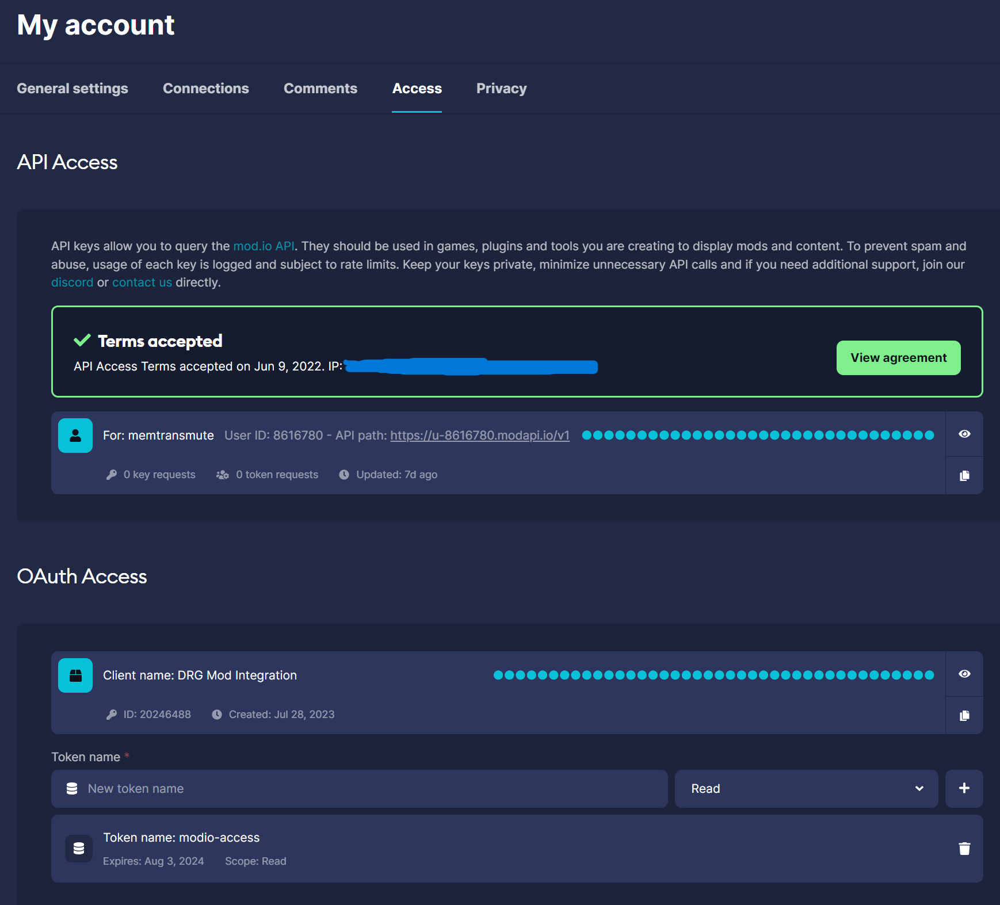

# 快速开始

`MINTCAT` 是一款虚幻引擎游戏的 MOD 管理器，目前只支持`《深岩银河》`这款游戏，后续会支持更多的虚幻引擎游戏。

## 版本升级
`MINTCAT 0.4.x` 版本是 `MINTCAT` 的重大升级，重写界面和底层安装等全部逻辑，提供了更好的用户体验。

+ 关于版本升级的提示： 
>  1. 如果你曾经使用过 `MINT 0.2.x` 版本，或者 `MINTCAT 0.3.x` 版本。 那么作为老用户，你的系统中已有必要数据，可以跳过新用户的步骤。
>  2. 升级 `MINTCAT 0.4.x` 版本并不需要你手动卸载旧版本。如果你执意卸载，把旧版本的 exe 删除即可。
>  3. `MINTCAT` 支持将旧版本数据自动导入 `MINTCAT 0.4.x` 版本，无需担心数据丢失。

## 安装 / 卸载
在 `MINTCAT 0.4.x` 以后的版本将应用程序打包在一个独立的 exe 安装文件中，便于用户安装和卸载。
下载地址 [Github](https://github.com/iriscats/mintcat/releases)

+ 安装步骤：
  1. 下载 `MINTCAT 0.4.x` 版本的安装包。
  2. 运行安装包，按照提示安装 `MINTCAT` 到你的电脑中。
  3. 安装完成后，双击桌面上 `MINTCAT` 图标，即可打开软件主界面。

+ 卸载步骤：
  1. 在 `MINTCAT` 安装目录中找到 `uninstall.exe` 文件。
  2. 运行 `uninstall.exe` 文件，按照提示卸载 `MINTCAT`。

## 新用户
新用户需要填写授权，才能正常访问 `mod.io` 平台。

+ 获取 `mod.io` 授权
  + 点击侧边栏的 `设置`（齿轮）按钮，进入设置界面。
  + 点击 `打开 mod.io` 按钮，将会打开浏览器访问 https://mod.io/me/access 。
    
  + 如果您点击那个，它会提示您输入一个 mod.io OAuth 令牌。 要生成一个 mod.io OAuth 令牌。
  + 您需要接受 API 条款和条件。
  + 您需要在 OAuth 访问下添加一个新的客户端，输入名称，比如 `DRG Mod Integration`。
  + 创建一个名为 `modio-access` 的新令牌，具有只读权限。将令牌复制到集成工具的提示中。

  
## 老用户
老用户可以选择自动导入数据，将 `MINT 0.2.x` 版本，或者 `MINTCAT 0.3.x` 版本的数据装换为 `MINTCAT 0.4.x` 的数据。

+ 导入数据
  1. 安装完成后，第一次打开后将会出现提示 `发现旧版 MINT(0.2, 0.3) 配置文件，注意将会覆盖当前配置，是否导入？`。
  2. 点击 `确定` 按钮，将会自动导入数据。
  3. 点击 `取消` 按钮，将会直接进入软件界面。
  
> 注意：如果使用过 `MINTCAT 0.4.x`，存在用户数据，并且不希望覆盖之前的数据，那么需要点击`取消` 按钮不导入数据。

## 设置游戏路径
如果
  1. 点击侧边栏的 `设置`（齿轮）按钮，进入设置界面。
  2. 点击 `保存` 按钮，将会保存游戏路径。
  3. 点击 `测试` 按钮，将会测试游戏路径是否正确。
  4. 点击 `保存` 按钮，将会保存游戏路径。

## 添加 Mod
目前支持安装 2 种来源的 Mod：
+ 从 `mod.io` 平台安装
  1. 点击侧边栏的 `Mods` 按钮，进入 Mod 列表界面。
  2. 点击 `添加 Mod` 按钮，将会打开浏览器访问  点击侧边栏的 `Mods` 按钮，进入 Mod 列表界面。
  3. 点击 `添加 Mod` 按钮，将会打开浏览 点击侧边栏的 `Mods` 按钮，进入 Mod 列表界面。
  4. 点击 `添加 Mod` 按钮，将会打开浏览器访问 URL_ADDRESS.io/ 。
  5. 搜索你想要安装的 Mod，点击 `安装` 按钮，将会打开浏览器访问 URL_ADDRESSRESS.io/ 。
  6. 搜索你想要安装的 Mod，点击 `安装` 按钮，将会打开浏览器访问 https://mod.io/ 。

+ 从本地文件安装
  1. 点击侧边栏的 `Mods` 按钮，进入 Mod 列表界面。
  2. 点击 `添加 Mod` 按钮，将会打开文件选择器，选择你想要安装的 Mod 文件。
  3. 点击 `安装` 按钮，将会开始安装 Mod。

+ 更多平台
  + 后续版本将会支持 

## 启动游戏
当全部 Mod 安装完成后，点击标题栏的 `启动游戏` 按钮，将会开始打包，并且安装当前列表全部 Mod，当安装完成后，将会自动启动游戏。

 
 
 